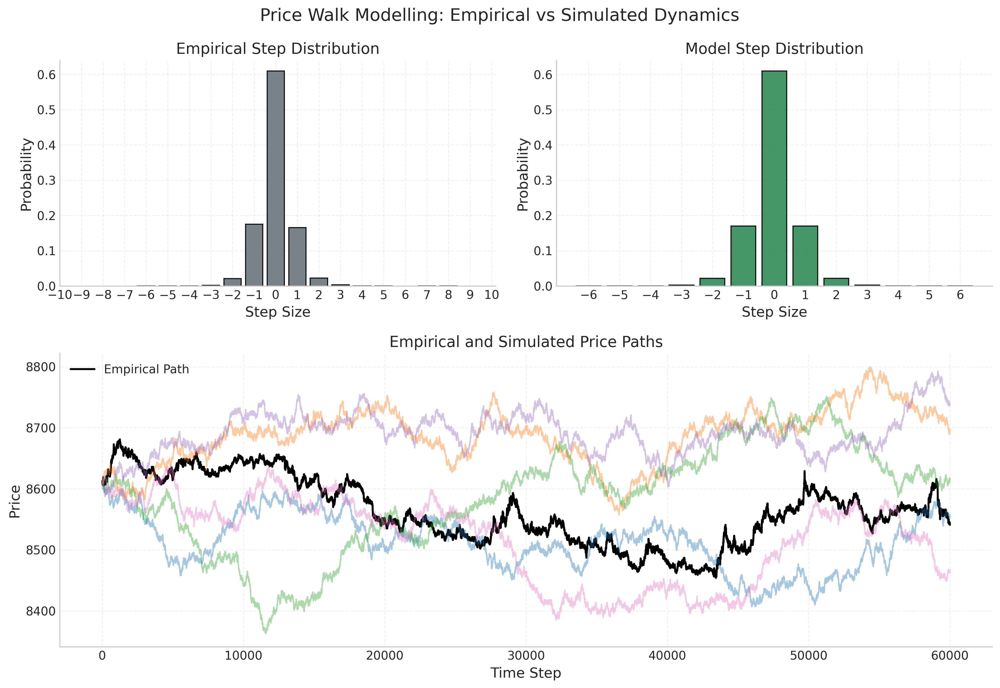
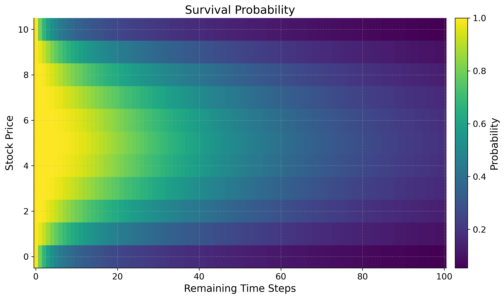

<h1 align="center">WHAT'S THE IMPACT</h1>

  <strong>🏅 Placed 6th Globally in IMC Prosperity 3 (2025)</strong> 
  <em>Among 12,000+ competing teams worldwide</em>

**Team:**
- Jonatan Svensson  
- Jack Sherry  
- Adam Leddy  
- Conor Duddy  

---

## Overview

This repository outlines our submission to the 2025 **IMC Prosperity 3** algorithmic trading competition — a global event that attracted over 12,000 teams. The challenge spanned five rounds, with new products and market complexities introduced every three days. In each round, teams submitted autonomous trading scripts designed to maximize PnL across synthetic markets that emulate real-world dynamics — including market making, ETF and options trading, cross-exchange arbitrage, and counterparty-driven strategies. Each round also included a game-theoretic problem, though these played a minor role relative to the algorithmic component.

After making no profit in the first round due to technical issues, we made a strong comeback and ultimately placed **6th globally**. We attribute this performance to a mix of curiosity, collaboration, and genuine enthusiasm for the kinds of problems that arise in the pursuit of optimal trading strategies. Despite juggling **three theses**, **six exams**, and even the **Irish Open Main Event** during the 15-day competition, we maintained a highly collaborative environment that allowed us to develop and iterate on sophisticated strategies across a wide range of products.

From the start, we treated the competition as a chance to learn — a way to get hands-on experience with algorithmic trading by building real strategies under pressure. We were more interested in understanding the problems than in chasing the leaderboard, which is why we chose not to take shortcuts like relying on recycled data[^1]. We focused on strategies that would make sense in a real trading environment — the kind you'd actually want to run if the PnL were yours to keep — rather than taking on excessive risk just to shoot for a top ranking (which, of course, is exactly what you're incentivized to do in a competition skewed toward the very top placings).

What follows is a product-by-product breakdown of the strategies we developed. We’ve left out the game-theoretic problems to keep the focus on the core algorithmic challenges.

  

---

[^1]: The first few rounds were plagued by teams hardcoding strategies, as IMC reused publicly available data from earlier editions of the competition.

 GENERAL APPROACH TO STRATEGY GENERATION 

 

Coming into the competition we had no idea what to expect, but we knew that time management would be hugely important to our success. We therefore placed a large emphasis on having an effective workflow when it came to strategy development. With the rounds being quite short and with each team member having time commitments beyond the competition, it was imperative that we didn’t waste time when developing strategies. Outlined below is a general overview of how we structured our workflow going into each round. 

## Fair Value Estimation

Before constructing any strategy we wanted to make sure that we were confident in our fair value estimations for each product. For both products in the tutorial round our initial approach was to take the mid price of the largest order on either side of the book. After submitting a couple of initial test algorithms we recognised that our PnL was given at each timestamp and this took into account our positional value as well, which suggested that there was a true fair value for each product at each timestamp. We then realised that we would be able to take advantage of this and submitted an algorithm that traded once in the first timestamp and held this position until the end of the submission. By tracking the PnL we were able to back out the true fair value evolution for each product and compare it with our estimation using the data from the orderbook. We found that the mid price of the large orders was consistently accurate at tracking the true FV. We therefore proceeded to use this as our estimation of the fair value in each of our submissions. We did however make sure to test these estimations on the submission data at the start of each new round. 

## Analysing Order Flow 

Our analysis of each new product began with analysing the direction and size of the orders traded. We first looked at the signed volume traded, looking in particular at the direction that the aggressor had taken. We were able to infer the aggressors direction by comparing the price at which the order traded with the mid price of the market on the same timestamp as the trade. We found that there were serious flow imbalances in multiple products, typically with the aggressor persistently selling throughout the session. We hoped to find some directional information encoded in these flow imbalances, however, there was no sign that the signed volume had any impact on the price of the asset. This was something that confused (and frustrated) us massively throughout the rounds, until in Round 5 details of counterparties were released and we were able to fit a narrative to these trading patterns. We found that two parties were simply trading with each other, one of which was market making and the other was either consistently buying or selling from them. For example Pablo consistently sold options regardless of the price to Camilla, who was market making and profiting consistently from him crossing the spread (He was consistently selling the 10500 strike options to her for 0 seashells !). 

We also hypothesised that such trading patterns should result in a large amount of market impact, with persistent selling driving the price of the asset down. However, once again this was not the case. This can potentially be explained by the fact that at the end of each session our positions (and presumably those of our counterparties) were liquidated. We probably should have expected this, as we were almost certain (and became certain after people hardcoded) that the price paths for each product in each round were predetermined. However, we would have been remiss if we had not at least checked for market impact given our team name : “What’s the Impact?”

## Exploring Opportunities and Optimising Execution

After developing a small intuition for the market microstructure of each product, we explored any trading opportunities specific to each product that we suspected might exist. We leveraged our understanding of each of the products to direct our focus on where these potential opportunities might lie.

Once we had identified a potential signal we shifted our focus to trying to implement a strategy to act on this signal. We typically used the backtester or simple backtesting in Jupyter notebooks to assess the profitability of signals, before deciding on whether or not to incorporate them into our strategy. If the signal turned out to be a profitable one, we then turned our attention to optimising our execution. For each strategy we explored whether it was optimal to act on the signal through market making and/or taking. We used the submission to test the behaviour of the bots when market making, and gauge how their behaviour impacted our execution. 

We also tested different size and edge requirements in each scenario, which proved to be extremely worthwhile as in certain cases this resulted in massive PnL improvements. Through testing liquidation rates (how quickly you could reach a max short/long position at different edge requirements) for different products, we were able to convert our execution into a simple optimisation problem, allowing us to determine an optimal trade size and edge requirement.

---

 SHORT SUMMARY 

 
  
## Round 1

## Round 2

## Round 3

## Round 4

## Round 5

---

RAINFOREST RESIN - a DP solution to optimal market making in a simplistic setting 

Under mild assumptions the problem becomes optimally solvable.

---

KELP - Market Making & Taking 

 

Kelp was one of the two products available to trade in the tutorial round, and as such we initially invested a lot of time into optimising our strategy. Unlike Rainforest Resin, Kelp was much more volatile and presented the potential for directional bets as well as simple market making/taking strategies. 

In a similar fashion to how we approached trading all new products, we started by analysing the flow in Kelp and found that the aggressors in the trades were persistently selling across each trading day. However, there was no directional information or signal encoded in the volume that we could find. After this initial analysis we started to develop our market making & taking strategy. 

## Market Making & Taking

The first step in this process as always was establishing our fair value, which once again we were able to determine by submitting a single trade algorithm to the submission in order to back out the true fair. When comparing this with the mid price of the largest orders on the bid and the ask we found that our estimate was always within +- 0.25 of the true fair. From here we built our strategy up, starting with market taking which was very simple: we would simply take anything in max size that had any edge. We also added in a condition that if we could trade for 0 edge and flatten our position we would. This helped us to avoid hitting the position limits of +- 50 which was the main constraint when it came to PnL maximisation. 

Next, we implemented a simple market making strategy which took the updated orderbook after we had interacted with it and placed ourselves top of book, just inside the previous top of book order, provided it was edgy to do so. If the current top of book was quoting only 1 seashell away from fair we would join them at the top of the book. We would market make in the maximum size possible that wouldn’t put us over the position limit and thus cancel our order. After implementing this we experimented with trying to convert our edge and size requirements into an optimisation problem where we would model the bot’s behaviour in a similar manner to our initial trading in Rainforest Resin. However, after our Round 1 script didn’t run we decided to abandon this, prioritising robustness and simplicity in our strategy.

## Directional Information

In the final round we got information on who the counterparties in each trade were and we found that Olivia had directional information about the price of Kelp. We found that she traded twice each day, buying the global min and selling the global max. However, the difference between these values on most days was only 15 seashells. With a position limit of 50 this meant we could only expect a profit of around 750-1000 seashells per day by following her trades. Our market making/taking strategy was making us close to 6k per day and as a result we decided to forego incorporating her trading into our strategy. If we had more time we might have invested more time into skewing our markets and edge requirements to make a directional bet, as well as capturing the two way flow throughout. However, we felt as though there were far more profitable opportunities elsewhere when we came across this that we decided to simply ignore it. 

---

SQUID INK - mean reversion 

## Initial Ideas

Squid Ink was introduced in Round 1, however it wasn’t included in the tutorial. We were initially at a bit of a loss as to how we should trade it, apart from some obvious opportunities. The most obvious of which occurred on 2 out of the 3 days of data given to us, where the price exhibited a massive price spike before immediately reverting to its previous level. One of these spikes gapped down over 100 seashells before reverting, presenting an opportunity to profit over 10k seashells in only 2 timestamps. 

We initially implemented a strategy to capture this opportunity by tracking the price in the previous timestamp and comparing it with the current price (current price - previous price). If the difference was < -50 (an arbitrary number that we set) we would clear the offer, and if it was > +50 we would clear the bid on the orderbook. 

However, aside from capturing these massive pricing inefficiencies we struggled initially to identify any opportunities in trading the ink. We analysed the volume traded, trying to see if it was a leading indicator for price movements, however this was to no avail. Then 24 hours before the end of the round a hint was posted in the wiki, suggesting that the price of the ink was mean reverting. This was something that we had initially noticed, however with only 3 days of data we had little confidence in making large directional bets based on this little amount of data. However, without a solid strategy otherwise we took the hint onboard and began to develop a strategy to profit from this mean reversion. 

## Bollinger Bands

In order to capture the mean reverting behaviour we used a Bollinger band strategy. This strategy tracked the moving average of the stock price as well as a rolling standard deviation. When the stock price moved outside of the bands (defined by the rolling mean +- x standard deviations) we would take on a position and when it crossed back over the moving average we would exit our position. We used a grid search to optimise our parameters by testing different band widths to enter and exit the position, as well as testing different window lengths to compute the rolling mean and standard deviation over. We found that regardless of what parameters we used the strategy failed to perform well everyday. Recognising this and the danger of overfitting such a strategy to an extremely limited dataset we used relatively conservative parameters (using $\pm 3 \sigma$ as our bounds to enter positions) and exiting positions aggressively (exiting when it crossed back inside $\pm 1 \sigma$ in the same direction). 

With the orderbook on squid ink so tight (only 1 seashell wide in total) we didn’t invest much time into the execution of our trades, we simply took the top of the book orders.

## Incorporating Olivia

We used this strategy in Rounds 1 - 4. In Round 5 data on counterparties was released and we discovered Olivia, who traded twice per session buying at the global minimum and selling at the global maximum. We adjusted our strategy to follow her trades and stopped using the Bollinger bands. Following her trades netted roughly 10k profit on average per day. This strategy was extremely easy to implement, however it was important that we didn’t miss out on her trades when the opportunity only lasted one timestamp. There were multiple days where the single timestamp spikes corresponded to the global max/min before immediately reverting. If we had implemented a strategy that only followed Olivia’s trades we wouldn’t have gotten the trade data until the timestamp after, when the trading opportunity was gone. In order to ensure that we didn’t miss these spikes we kept our logic that traded in max size if the price spiked up or down in a single timestamp, regardless what position Olivia had on. Once the price had spiked we waited a small period before putting on the same position that Olivia had on. This strategy actually meant that we outperformed Olivia on days where the single timestamp spikes didn’t correspond to the global extrema. 

Having the knowledge of where the global max and min of the price lies in a session gives us additional information that we can profit from. This is discussed in more detail in the Labeled Counterparties section. 

---

BASKETS (ETFs) - statistical arbitrage 

dont include olivia here

---

VOLCANIC ROCK VOUCHERS (options) - volatility smile

 

The Volcanic Rock and the Vouchers were released in Round 3. Paired together, the vouchers acted as traditional European call options with the Volcanic Rock acting as the corresponding underlying stock. When they were first introduced the options had 5 days to expiry, with each round representing a trading day. There were 5 strike prices for these vouchers: 9500, 9750, 10000, 10250 and 10500. 

As a team we cumulatively invested by far the most time into these products, spending a large amount of time on them throughout each of the rounds that they were tradable. We decided to commit so much time to them for a couple of reasons: For one, we felt that they represented by far the largest opportunity out of any of the products in the competition, and therefore spending time fine tuning our strategy would yield the highest return on our time investment. Secondly, exploring different opportunities in trading these options excited us. They were by far the most nuanced product to trade and they offered huge learning opportunities to all of us, which we both enjoyed and were grateful for the fact that we had spent time trying to understand them. Allocating our time in this manner proved to be extremely fruitful, with it being the main catalyst to our rise up the leaderboard in the latter rounds. Thanks mostly to our options strategy we rose from 667th in Round 2 to 98th place in Round 3, before climbing all the way up to 6th place in the world at the end of Round 4. Our Algo PnL in Round 4 was the 3rd highest in the world judging off Jasper’s leaderboard. 

Having spent so much time developing and testing different strategies we could probably write our entire recap on the trading in the Vouchers, however, in the interest of keeping the recap length short we will try to summarise everything we did succinctly and efficiently. 

## Initial Strategy Ideas

Before diving into any complicated trading strategies we initially explored some simple avenues where we thought opportunities may exist. The simplest of such involved exploring whether the options traded outside of their arbitrage bounds. We found that there were many instances where the 9500 strike options (deep in the money) traded exactly for their intrinsic value, suggesting that they had 0 time value. We therefore tried to implement a strategy that would buy these options whenever they had 0 time value and sell them above whatever we estimated their fair value was (having a time value of >= 1). However, we quickly found that while the options traded at this price, due to others market making before us, with price time priority it was very rare to get filled buying for parity. In the cases that we did get fills we were still extremely exposed to moves in the underlying, which made this strategy even less appealing. We didn’t find any other opportunities when looking at the arb bounds, apart from the 10500 strike options (deep OTM) trading for 0, but for the same reasons as above it wasn’t possible to capture any of this flow. 

After exploring the arb bounds, we turned our attention to the order flow in the options. We hypothesised that certain market participants would express their opinion on the direction of stock through the options. We noticed that there were numerous instances where options would be sold simultaneously across all 5 strikes. Through looking at the historical trades we explored the stock returns following periods where large orders in the options were executed. We had hoped to find that large options trades would frontrun moves in the stock price, however, we found no sign of any information being encoded in these orders. We weren’t entirely surprised at this result, as up until this point the flow seemingly hadn’t had any directional information encoded in it. When the information on market participants was released in Round 5, we were able to confirm our conclusions that the orderbook flow was benign.

## Trading Around the Vol Smile

After exploring these initial strategies we were very confident that the source of the opportunity with the options lay in the relative mispricings across strikes. This was confirmed in the wiki when a hint was released, suggesting that we plot a curve of the implied volatility of each of the options against the moneyness. Plotting this curve as opposed to the volatility smile (IV vs Strike) factored in the time to expiry as well as the strike. Through using the Newton Raphson algorithm to compute the IV, we were able to plot the IV against the moneyness for each of the options from the previous 50 timestamps (we grid tested different window lengths before settling on 50). By fitting a second order polynomial to these points we were then able to define a decision line which we would trade around. The curve allowed us to identify relative mispricings across strikes, selling options where vol was expensive with an IV above the curve and buying options where vol was cheap. In Round 3 we weighted each of the options equally, before refining this aspect of the strategy prior to Round 4 and we will explore this in further detail below as it was a key part of the strategy. 

## Delta Hedging

Initially, after implementing trading around the curve we used the underlying Volcanic Rock to hedge our delta position that we picked up from trading the options. However, it quickly became clear that our strategy was prone to picking up large delta positions in the instances where we had the same position in the ITM strikes, which had the largest delta. In these cases, due to position limits in the products, it was impossible to fully hedge our delta. Since there were large intraday moves in the underlying (upwards of 300 seashells) this wasn’t a risk that we wanted to take on. With this in mind and bearing in mind the fact that 9500 strike options practically traded for parity, meaning there was very little opportunity to make money from gamma, we decided to use the 9500 strike options to hedge our delta as well. This meant that we would be able to hedge our position in its entirety without sacrificing too much edge. 

We were very cognizant of not sacrificing too much edge through hedging too regularly and crossing too many spreads. This led us to settling on a delta hedging strategy where we tried to capture edge in the 9500 strike options if it flattened our delta position. At each timestamp we would calculate our total delta position and if it was edgy to market take the 9500 options for edge relative to our volatility curve we would trade enough to hedge our delta completely, or as much as we could, whichever was less. As the stock traded very tight in large size it wasn’t possible to market make for edge, so we used the stock to hedge our delta whenever the magnitude of our delta position exceeded a threshold. This ensured that we didn’t over-hedge and kept the number of instances where we were crossing the spread to a minimum. 

---

MACARONS - cross-exchange arbitrage

WHAT'S THE IMPACT

---

LABELED COUNTERPARTIES – a DP solution to optimal use of insider information

 

## Short Summary
In the final round, counterparty identifiers were added to the historical data. This meant that for every trade, the identities of both the buyer and seller were disclosed — and this information would also be available in real time during the final submission. There were 11 market participants, each focused on their own subset of products.

We began by plotting PnL for each counterparty, split by product and decomposed into execution and holding components. Some counterparties generated substantial execution PnL by consistently trading at favorable prices. However, this insight offered limited value for refining our algorithms, as we were already fully exploiting those opportunities through aggressive market making.

Only one counterparty stood out in terms of holding PnL. Upon further inspection, it became clear that they exclusively bought at the daily minimum and sold at the daily maximum — without taking any other trades. This behavior was observed only in Kelp, Squid Ink, and Croissants.

Due to Kelp’s relatively stable price dynamics, directional bets based on this min/max behavior were unlikely to generate enough profit to justify displacing our existing market-making strategy.

Squid Ink, on the other hand, was more promising. With large daily swings, the historical PnL from a simple min/max strategy matched the performance of our current approach. Since our existing Squid Ink strategy didn’t rely on market making, we could layer in directional trades without cannibalizing our core PnL. The only modification required was to shorten the liquidation horizon for mean-reverting trades whenever a directional bet was active.

Trading the min/max for Croissants proved highly profitable, thanks to large daily price swings and generous position limits. Since Croissants had previously been used only to hedge basket exposure, this new directional strategy introduced no conflicts with our existing setup.
We quickly realized that Croissant exposure could be scaled up indirectly through the baskets. To evaluate this, we used historical data to compare the PnL of a Croissant-driven basket strategy against the statistical arbitrage approach we had relied on in earlier rounds. On average, the two performed similarly, though daily results could diverge significantly.
To capture the strengths of both, we adopted a hybrid approach: we introduced a Croissant-based term into the basket's target position (see section on basket trading). The weight of this term was calibrated through backtesting on historical data.

This summarizes what we managed to implement before the final submission. After climbing from #98 to #6 in Round 4, we knew our algorithm was strong. Still cautious from the technical issues in Round 1, we chose to focus on delivering a robust and reliable script rather than pushing for further complexity. That said, some of the ideas we explored were promising enough to deserve a place in this write-up. The next session discusses on of them.

---

## Dynamic Programming Again?

The information contained in the global minimum and maximum of a random price walk can be leveraged more effectively than simply buying the minimum and selling the maximum. Once both extrema have occurred (noting that we only observe them as they happen), we gain a powerful constraint: the remainder of the walk must remain within the established min-max range. This fundamentally alters the distribution of future prices.
To illustrate this, consider the following edge case: the global minimum occurs, and we initiate a long position. Later, the global maximum is reached, and we switch to a short. If the price subsequently falls back to the level of the previously announced minimum, we now know with certainty that it cannot drop any further — doing so would contradict the declared minimum. This allows us to confidently enter a long position, exploiting the boundary created by the known extrema.

### Overview of this section

- Modelling Price and Establishing Assumptions
- Bayesian Approach to Utilizing Information from Bounds
- Setting Up and Solving Dynamic Program for Optimal Trading
- Evaluating Performance of Resulting Strategy
- Concluding Remarks

### Price walk model
To develop this idea into a trading strategy, we first need a model for the price walk. Squid Ink was excluded from consideration due to its intentionally erratic behavior — designed to exhibit large, irregular jumps followed by reversion. Cracking the logic behind its generation would likely yield more generalizable edge elsewhere. Kelp, on the other hand, lacked sufficient volatility to make the min/max-based strategy actionable.
We therefore focus exclusively on Croissants. As discussed earlier, using the midpoint of the largest quantities in the order book gives a strong approximation of fair value. In Croissants, the spread between the two largest levels is typically one or two ticks, resulting in fair values that are either integers or half-integers. By multiplying all prices by 2, we obtain clean integer-valued price paths.
A reasonable model assumes that the price evolves as an i.i.d. random walk with steps drawn from a symmetric distribution. The figure below shows the empirical step distribution alongside a simplified model in which rare outliers are removed and symmetry is enforced.

  

### Utilizing the bounds
In this section the goal is to condense all information from the given bounds so that we can use it in our upcoming dynamic program. We work in a grid of shape `(remaining time steps) × (current price)`, and at each point on this grid we aim to adjust the step distribution based on the information from the bounds. Far from the bounds or with few steps remaining, the step distribution remains essentially unchanged. In contrast, points near the upper or lower bound are subject to sharply skewed distributions: for instance, if the price is near the upper bound, downward steps become significantly more likely under the constraint that the walk must stay inside the range.

This conditioning can be formalized in a Bayesian framework. Knowing the bounds removes all future paths that would exit the allowed region. From any given point, we discard such violating paths and reweight the remaining ones to compute the updated distribution for the next step. Naively computing this requires evaluating all possible paths — an intractable problem, as the number of walks scales exponentially (e.g., 13^t with t ~ 10,000).

To make this computation feasible, we instead begin by computing the **survival probability**: the probability that a walk starting from a grid point remains within the bounds until the end. This can be done recursively in time. We initialize at t = 1, where almost all points have survival probability 1 — except those close enough to reach outside the boundaries in one step. From there, we propagate survival probabilities backward using a weighted sum based on the step distribution at each slice in time. This recursive approach allows us to efficiently calculate, for any point, what proportion of paths from there end up inside and outside the bounds.

The figure below shows the resulting survival probabilities under the bounds [0, 10], assuming the following step distribution:

`step-prob = {0: 0.6, ±1: 0.17, ±2: 0.03}`

As expected, points near the bounds and with a lot of time left in the session are likely to walk outside the bounds, whereas points far from the bounds and close to the end show high survival probability.

  

From the survival grid, the step distributions are updated by reweighting each possible move according to the survival probability of the resulting state, and then normalizing to form a valid probability distribution. With these skewed, state-dependent step distributions in place, we can now formulate a dynamic programming algorithm to derive the optimal trading strategy.

### DP Formulation and Solution

**Note:** This DP formulation can be applied even without any bounding constraints on the price. However, in the case of a symmetric step distribution, the expected value of any trade becomes negative — since price changes have zero expected drift, and each trade incurs a cost from crossing the spread. It is precisely the bounds on the future price path that introduce asymmetry into the step distribution, making trading directionally profitable and the problem worth solving.

Problem formulation:
Given a realization of an i.i.d. random walk with a known step distribution 

Variables:
 * t - time left in session. After this time the lower and upper bounds no longer hold.
 * L - position limits.
 * s(t) - stock price with t iterations left in session.
 * BL, BU - upper and lower price bounds.
 * Spread - Cost/unit of crossing spread
 * x - position

Note that we need to wait for the second extrema before there will be enough information to trade. After the first we will enter a position one way. The bound we are given will only ever alter the rest of the walk in favour of our position and we will therefore not trade until the second extrema.

### Performance

### Remarks

include something about how easy tis would be to implement by jsut fitting one polynomial

